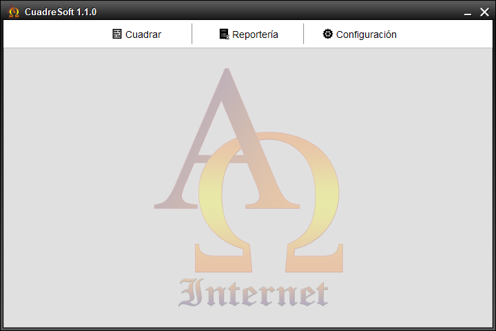
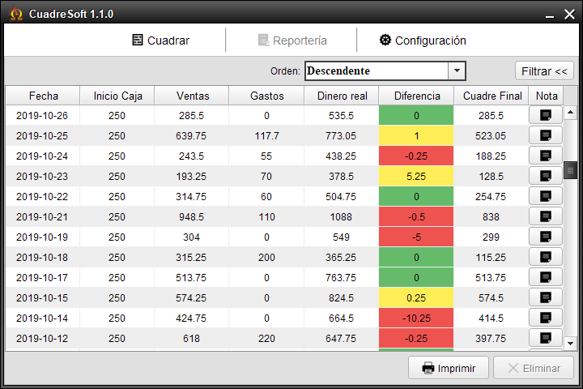
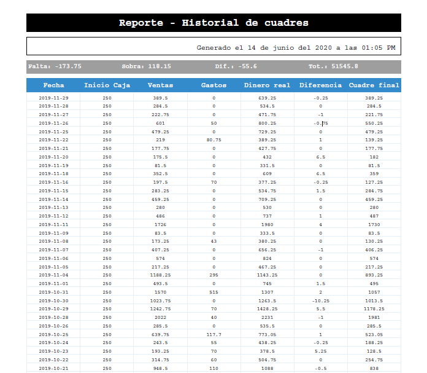

# CuadreSoft

## Informacion sobre el proyecto

**Descripcion del proyecto**

- Proyecto creado en Eclipse IDE Version: 2019-09 R (4.13.0).
Escrito en Java version 8 con Java Swing y AWT para interfaz grafica
y para el almacenamiento de la data utiliza el gestor de base de datos sqlite3

**Requitos para desarrollo del proyecto**

- Java SE JDK 8
- Eclipse IDE Version: 2019-09
- Cualquier gestor de base de datos sqlite de preferencia (recomendado: DB Browser for sqlite)